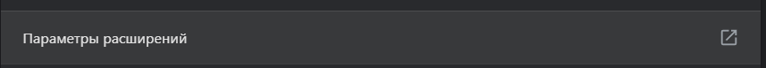
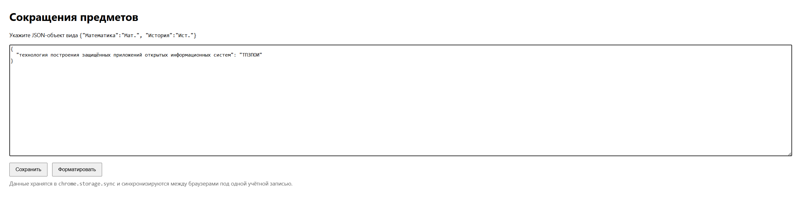

# Schedule Shortener

Расширение для Chrome, которое заменяет **полные названия предметов** в [расписании](https://ssau.ru/rasp) на **сокращённые**.

## 🚀 Возможности
- Сохраняет ваши сокращения в `chrome.storage.sync`
- Автоматически заменяет названия на странице расписания
- Настройки через интерфейс расширения

---

## 🛠 Установка производится локально

1. Скачайте ZIP-архив проекта.
2. Распакуйте его в любую папку.
3. Откройте `chrome://extensions`.
4. Включите **Режим разработчика** (правый верхний угол).
5. Нажмите **"Загрузить распакованное"**.
6. Выберите папку с проектом.
7. Готово ✅

---

## ⚙️ Настройка сокращений

1. В `chrome://extensions` откройте свединия данного разширения .
2. Нажмите **"Параметры расширений"**.
3. Вставьте JSON с вашими сокращениями, например:

```json
{
  "Математика": "Мат.",
  "История": "Ист.",
  "Информатика": "Инф."
}

    